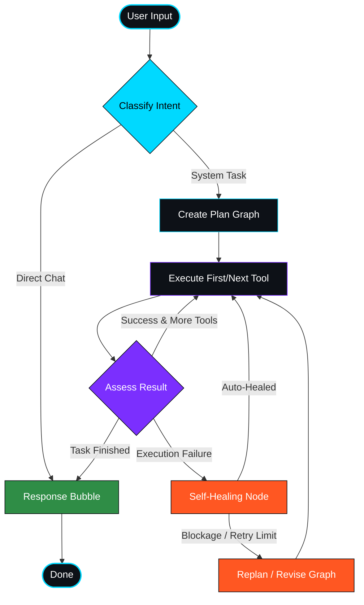

<div align="center">

<!-- ANIMATED HEADER BANNER -->


<!-- ANIMATED TYPING -->
<br/>

[](https://git.io/typing-svg)

<br/>

<!-- REPO METRIC BADGES -->
<a href="https://github.com/OpenSarthi/opensarthi/stargazers"></a>&nbsp;
<a href="https://github.com/OpenSarthi/opensarthi/network/members"></a>&nbsp;
<a href="https://github.com/OpenSarthi/opensarthi/issues"></a>&nbsp;
<a href="https://github.com/OpenSarthi/opensarthi/pulls"></a>&nbsp;
<a href="https://github.com/OpenSarthi/opensarthi/blob/main/LICENSE"></a>&nbsp;
<a href="mailto:kumarkartik147359@gmail.com"></a>

</div>

<br/>

<!-- ═══════════════════════════════════════════════════════════════════════════════ -->
<!-- 💡 WHAT IS OPENSARTHI                                                         -->
<!-- ═══════════════════════════════════════════════════════════════════════════════ -->


## 🤖 &nbsp;What is OpenSarthi?

OpenSarthi is an **agentic AI assistant** that executes local commands, automates workflows, and intercepts hardware events:

- 🗣️ **Speak and listen** — Full voice pipeline with wake word detection, local STT, and TTS voice synthesis.
- 🖥️ **Automate your desktop** — Cursor clicking, keyboard emulation, screen snapshots, shell command parsing, and app launching.
- 📱 **Run on Android** — Integrated mobile agent packages powered by Capacitor + Chaquopy in-process environments.
- 🦾 **Flexible LLM Backend** — Model-agnostic configuration supporting Gemini, Claude, GPT, Groq, OpenRouter, and Ollama.
- 🪙 **Token Accounting** — Real-time tracking separating requests and active model session aggregates.
- 🔧 **Customizable Skills** — Gated capability sets mapped to specific user authorization groups.
- 🔀 **LangGraph Orchestration** — Advanced stateful graph scheduling with transaction-level crash-healing loops.

<br/>

<!-- ═══════════════════════════════════════════════════════════════════════════════ -->
<!-- 🏗️ REPOSITORY LAYOUT                                                          -->
<!-- ═══════════════════════════════════════════════════════════════════════════════ -->


## 🏗️ &nbsp;Repository Layout

```
opensarthi/
├── apps/
│   ├── desktop/          # Tauri + React desktop overlay client (Linux/Windows/macOS)
│   └── android/          # Capacitor + React Android native app wrapper
├── runtime/              # FastAPI + LangGraph Python sidecar (agent brain)
├── docs/                 # Architectural & protocol design specifications
├── SKILLS.md             # Developer guidelines & capabilities source-of-truth
└── README.md             # This repository README
```

<div align="center">

<table>
<tr>
<td width="50%">

### 🖥️ <a href="apps/desktop">apps/desktop</a>
Tauri v2 core hosting borderless HUD overlays. Integrates system trays, WebSocket telemetry streams, snapping layouts, and task timeline logs.
<br/>
→ [Desktop README](apps/desktop/README.md)

</td>
<td width="50%">

### 📱 <a href="apps/android">apps/android</a>
Capacitor-based hand-held client. Embeds the Python backend directly into the APK via Chaquopy for fully local offline execution.
<br/>
→ [Android README](apps/android/README.md)

</td>
</tr>
<tr>
<td width="100%" colspan="2" align="center">

### ⚙️ <a href="runtime">runtime/</a>
Core AI logic server. Executes intent classifiers, schedules tool calls, manages SQLite memory, and implements self-healing terminal rollbacks.
<br/>
→ [Runtime README](runtime/README.md)

</td>
</tr>
</table>

</div>

<br/>

<!-- ═══════════════════════════════════════════════════════════════════════════════ -->
<!-- 🔄 AGENT FLOW GRAPH                                                           -->
<!-- ═══════════════════════════════════════════════════════════════════════════════ -->


## 🔀 &nbsp;Agent Execution Graph (LangGraph)



<br/>

<!-- ═══════════════════════════════════════════════════════════════════════════════ -->
<!-- 📊 ANALYTICS & REPOSITORY GRAPHS                                              -->
<!-- ═══════════════════════════════════════════════════════════════════════════════ -->


## 📊 &nbsp;Repository Analytics & Metrics

<div align="center">

<table>
<tr>
<td width="55%" align="center">

### 📁 Repository Summary
<a href="https://github.com/OpenSarthi/opensarthi">
  
</a>

</td>
<td width="45%" align="center">

### 🔠 Primary Languages
<a href="https://github.com/OpenSarthi/opensarthi">
  
</a>

</td>
</tr>
</table>

<br/>

### 📈 Development Commit Activity


</div>

<br/>

<!-- ═══════════════════════════════════════════════════════════════════════════════ -->
<!-- 📝 TECHNICAL DOCUMENTATION                                                    -->
<!-- ═══════════════════════════════════════════════════════════════════════════════ -->


## 📑 &nbsp;Technical Documentation

| Resource | Scope & Purpose |
|----------|-----------------|
| 🖥️ **[01 — Frontend & Desktop Shell](docs/01_frontend_and_desktop_shell.md)** | React HUD overlays, Tauri IPC commands, state triggers, styles |
| ⚙️ **[02 — Backend Runtime & Infra](docs/02_backend_runtime_and_infra.md)** | FastAPI loop structure, dynamic port mappings, tool registries |
| 🧠 **[03 — Agentic Flow](docs/03_agentic_flow.md)** | Self-healing logic steps, PydanticAI structures, planner schemas |
| 🔌 **[04 — WebSocket Protocol](docs/04_websocket_protocol.md)** | Payload structure and schemas for client ↔ sidecar telemetry |
| 📱 **[05 — Android Implementation](docs/05_android_implementation.md)** | Capacitor layout integrations, Gradle configuration, Chaquopy setups |

<br/>

<!-- ═══════════════════════════════════════════════════════════════════════════════ -->
<!-- 🚀 QUICK START                                                                -->
<!-- ═══════════════════════════════════════════════════════════════════════════════ -->


## ⚡ &nbsp;Quick Start

### 🖥️ Desktop Execution
1. Install pnpm dependencies:
   ```bash
   pnpm install
   ```
2. Launch the sidecar runtime and development overlay:
   ```bash
   cd apps/desktop
   pnpm tauri dev
   ```

### 📱 Android Application
1. Build frontend React assets:
   ```bash
   pnpm install
   cd apps/android
   npm run build
   ```
2. Sync plugins and assets to Capacitor:
   ```bash
   npx cap sync android
   ```
3. Deploy and install debugging APK:
   ```bash
   cd android
   ./gradlew installDebug --no-daemon
   ```
   *(For full deployment details, review [Android Installation Guide](docs/05_android_implementation.md))*

<br/>

<!-- ═══════════════════════════════════════════════════════════════════════════════ -->
<!-- 🛠️ SUPPORTED PROVIDERS                                                        -->
<!-- ═══════════════════════════════════════════════════════════════════════════════ -->


## 🔌 &nbsp;Supported LLM Providers

| Provider | Supported Models | Performance Notes |
|----------|------------------|-------------------|
| **Google Gemini** | 2.5 Flash, 2.5 Pro, 2.0 Flash | Recommended default (lowest latency structured logs) |
| **OpenAI** | GPT-4o, GPT-4o Mini, GPT-4 Turbo | High reliability structured plans |
| **Anthropic** | Claude 3.5 Sonnet, Claude 3 Opus | Complex multi-step reasoning capabilities |
| **Groq** | Llama 3.3 70B, Llama 3.1 8B | Ultra-high inference velocity |
| **OpenRouter** | Any compatible model | Aggregated multi-endpoint routing |
| **Ollama** | Llama 3, Phi 3, Mistral | 100% offline local processing (0 token fees) |

<br/>

<!-- ═══════════════════════════════════════════════════════════════════════════════ -->
<!-- 🏆 DEVELOPER GUIDELINES                                                       -->
<!-- ═══════════════════════════════════════════════════════════════════════════════ -->


## 💡 &nbsp;Developer Guidelines & Invariants

Before making code edits, check **[SKILLS.md](SKILLS.md)** — the single source-of-truth for code constraints.

- **Dual Process Invariant**: Desktop runs Tauri + Python separately (linked via WebSocket); Android hosts Python inside Tauri/Capacitor in-process.
- **Safety Gating**: Modifying, deleting, or shell operations require user authorization unless marked as `SAFE`.
- **Typing Animations**: Word-by-word streaming must use the `Session.stream_text()` websocket protocol.

<br/>

<!-- ═══════════════════════════════════════════════════════════════════════════════ -->
<!-- 🌊 FOOTER                                                                     -->
<!-- ═══════════════════════════════════════════════════════════════════════════════ -->

<div align="center">

</div>

<div align="center">

**⭐ Part of the [OpenSarthi Project](https://github.com/OpenSarthi) — Engineered with 💙 and ☕**


</div>
