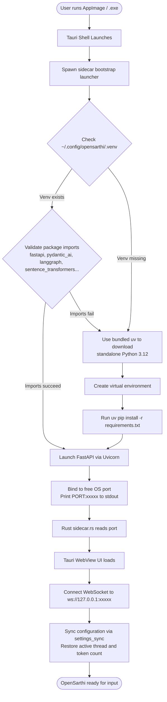
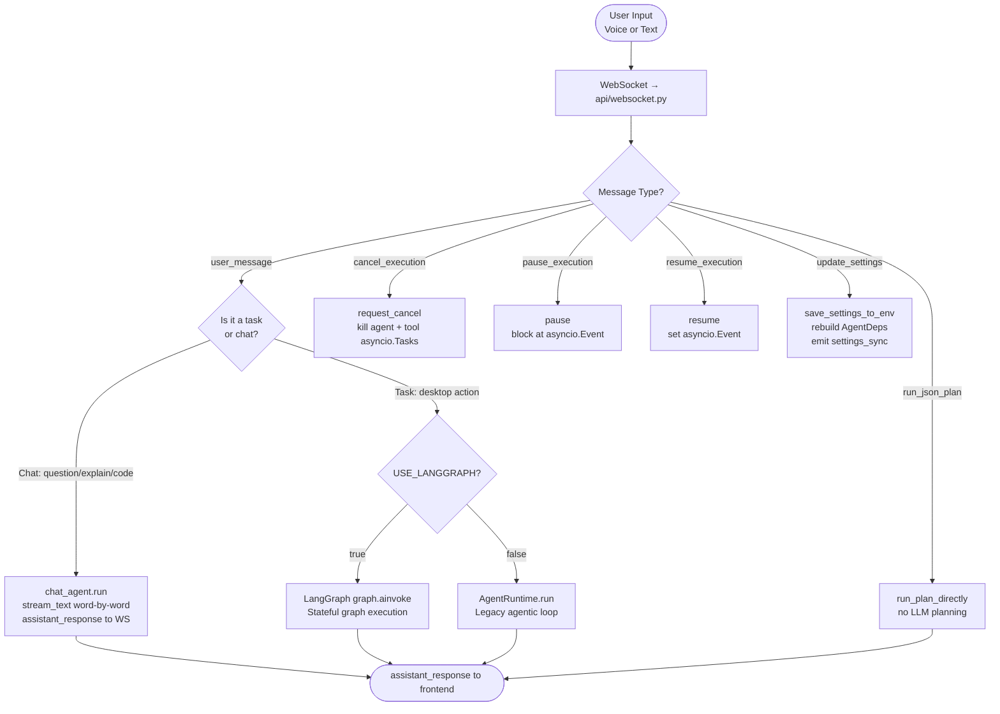
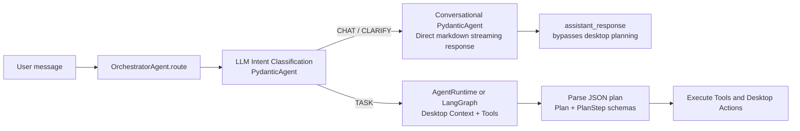
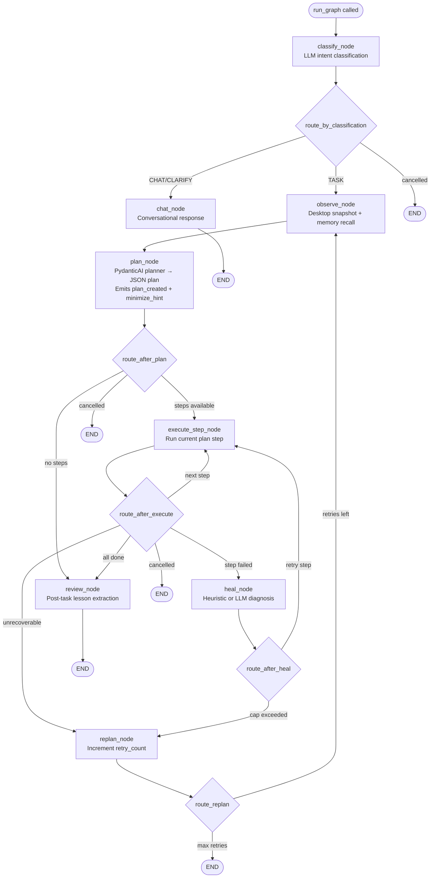
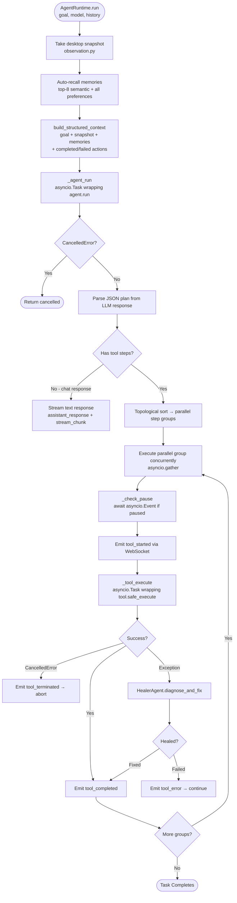
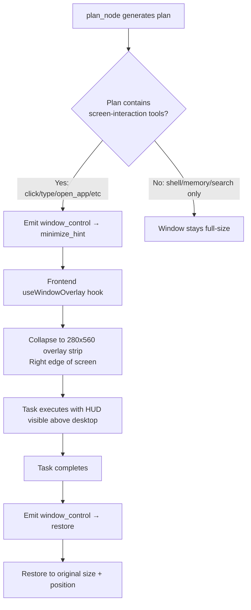
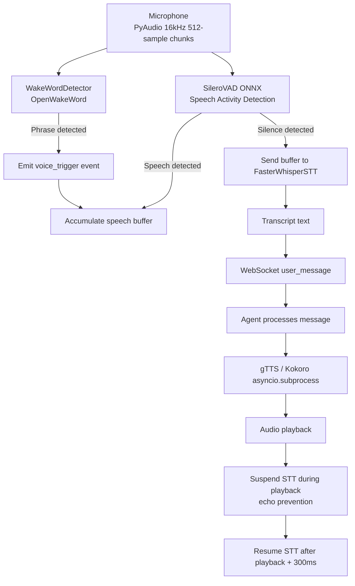
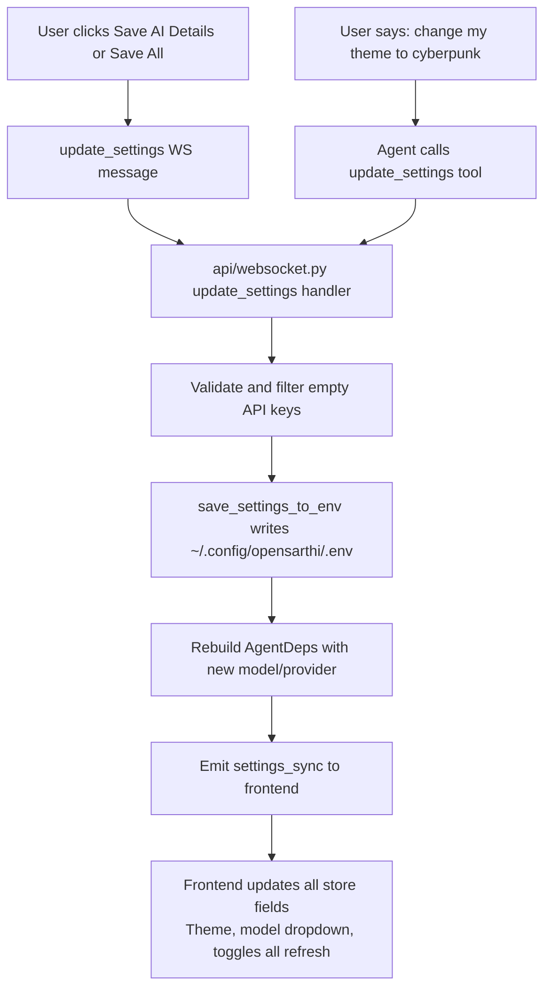
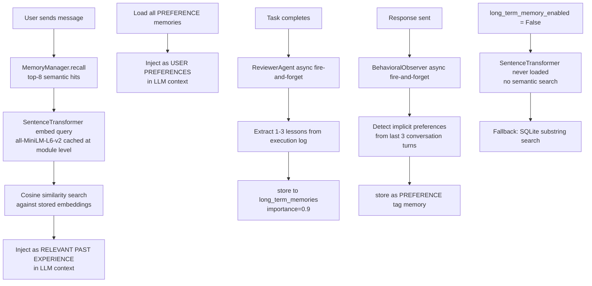
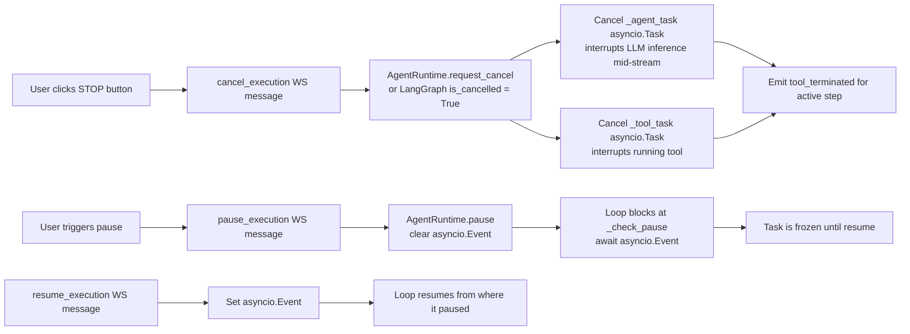

# OpenSarthi — Agentic Flow

This document describes the complete execution lifecycle of OpenSarthi from user input to final response.

> **Updated:** July 2026 — LangGraph dual-engine, SileroVAD ONNX, self-healing cap, smart overlay minimize, conversational settings tool, 32-tool registry, audio cues, multi-tab threads, and full markdown response rendering.

---

## 1. Packaged App Bootstrap & Startup Flow

---

## 2. Top-Level Message Flow

---

## 3. Intent Classification (Chat vs. Task vs. Clarify)

The orchestrator calls a lightweight `PydanticAgent` to classify each input into exactly one of three intents.

> **Key benefit:** `CHAT` inputs bypass the expensive desktop observation and planning loop entirely, returning beautifully formatted Markdown instantly. Only `TASK` inputs trigger window snapshotting, memory recall, and the full tool execution loop.

---

## 4. LangGraph Execution Graph (USE_LANGGRAPH=true)

The LangGraph engine is a compiled `StateGraph` with 8 nodes and full conditional routing.

### OpenSarthiState — Full Typed State Schema

All graph nodes read from and write partial updates into `OpenSarthiState`:

| Field | Type | Purpose |
|-------|------|---------|
| `goal` | `str` | Current user goal |
| `thread_id` | `str` | Active conversation thread |
| `classification` | `str` | CHAT \| TASK \| CLARIFY |
| `messages` | `list` | PydanticAI message history (do NOT use LangChain message coercion) |
| `plan_steps` | `list` | Current plan step dicts |
| `current_step_index` | `int` | Which step to execute next |
| `completed_actions` | `list[str]` | Human-readable step log |
| `failed_actions` | `list[str]` | Error log for replanning context |
| `cumulative_steps` | `list` | Full task history (survives replanning) for UI |
| `heal_attempts` | `dict[int,int]` | Heal attempt count per step index (cap: 2) |
| `retry_count` | `int` | Full replan count (max: 5) |
| `desktop_snapshot` | `dict` | Serialized DesktopSnapshot |
| `recalled_memories` | `list` | Top-8 semantic memory hits |
| `preferences` | `list` | All stored [PREFERENCE] entries |
| `last_tool_result` | `dict` | Most recent ToolResult |
| `is_cancelled` | `bool` | Abort signal set by cancel_execution |
| `is_paused` | `bool` | Pause signal set by pause_execution |
| `final_response` | `str` | Final text to broadcast |
| `total_request_tokens` | `int` | Accumulated input tokens |
| `total_response_tokens` | `int` | Accumulated output tokens |

### Checkpointing

- **Default:** `MemorySaver` (in-memory, survives execution, lost on restart)
- **Persistent:** `SqliteSaver` at `~/.config/opensarthi/checkpoints.db` (requires `langgraph-checkpoint-sqlite`)

---

## 5. AgentRuntime Loop (Legacy / USE_LANGGRAPH=false)

---

## 6. Self-Healing Sub-System

### HealerAgent Heuristics (No LLM Required)

| Failure Pattern | Auto-Fix Applied |
|---|---|
| `type_text` fails, "focus" in error | Inject `click_element` step before typing |
| `click` fails with coordinate issue | Suggest `click_element` with accessible name |
| `open_app` fails | Try alternate binary name |
| `wait_for_window` times out | Increase timeout by 3000ms |
| `shell` command not found | Add full path fallback |

### LLM-Based Healing

If heuristics cannot match the error pattern, HealerAgent calls the LLM with:
- The failed step definition
- The error message
- Current desktop screenshot
- A prompt asking for a corrected step

### Healing Retries Cap (Safety Limit)

To prevent infinite healing loops:
- **Per-step cap:** Maximum **2 heal attempts** per `step_index`, tracked in `OpenSarthiState.heal_attempts: dict[int, int]`
- **Fallback:** On the 3rd failure, healing is bypassed → `replan_node` rewrites the entire plan
- **Replan limit:** Maximum **5 full replans** (`max_retries=5`); after that the task is abandoned

### Self-Improving: ReviewerAgent (Post-Task)

After every completed task:
1. ReviewerAgent receives the full execution log
2. LLM extracts 1–3 concrete lessons from what worked / what failed
3. Lessons stored as `long_term_memories` with `source=self_review, importance=0.9`
4. On the next similar task, these lessons are auto-recalled into the planning context

### Preference Learning: BehavioralObserver (Post-Response)

After every response:
1. BehavioralObserver scans the last 3 conversation turns
2. LLM detects implicit user preferences (e.g., "prefers short answers", "uses dark themes")
3. Stored as `[PREFERENCE]` tagged memories
4. Always injected into every subsequent LLM context

---

## 7. Smart Overlay Window Management

OpenSarthi automatically manages its window size during task execution to avoid obstructing the desktop:

**User override:** If user clicks "Expand" during task → `userExpandedDuringTask` flag set → auto-collapse suppressed for that task.

---

## 8. Voice Pipeline Flow

**VAD (SileroVAD via ONNX Runtime):**
- Model resolution order: `faster-whisper` assets → `openwakeword` resources → `~/.config/opensarthi/models/`
- Falls back to RMS energy threshold if ONNX session fails to load
- Maintains recurrent LSTM state (`h`, `c`, `context`) across 512-sample chunks — pure CPU

---

## 9. Settings Update Flow

Settings can be updated in three ways:

1. **Frontend SettingsView** → sends `update_settings` WS message
2. **Voice/text command** → agent calls `update_settings` tool
3. **Onboarding wizard** → sends `update_settings` on completion

**Save granularity:**
- **"Save AI Details"** — saves only provider, model, and API key fields
- **"Save All Settings"** — saves everything (AI + voice + UI + memory)

---

## 10. Memory System

---

## 11. Cancellation & Pause Architecture

---

## 12. Token Tracking

Token usage is tracked at two levels:

| Level | Scope | Reset |
|-------|-------|-------|
| **Thread** | Per active conversation thread | On "New Thread" |
| **Session** | Cumulative across all threads | On app restart |
| **Global (per model)** | Lifetime token usage per model key | Persisted in localStorage |

Token data is extracted from PydanticAI `result.usage` — handles both `request_tokens`/`response_tokens` and `input`/`output` field name variants across PydanticAI versions.
